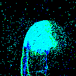

# Sneaky-Spikes

Code for the paper "Sneaky Spikes: Uncovering Stealthy Backdoor Attacks in Spiking Neural Networks with Neuromorphic Data" submited at USENIX'23.

Guide to the code is available [here](how_to.md).

## Examples

### Static Triggers

### Moving Triggers

### Smart Triggers

#### Clean Image

#### Trigger in the least important area

#### Trigger in the most important area

### Dynamic Triggers

#### Attack Overview

#### Dynamic Examples

|       $$\gamma$$            |   0.1	|   0.05	|  0.01 	|
|------------------	|---	|---	|---	|
| Clean image 	|   |  	|   	|
| Noise            	|   	|   	|   	|
| Projected  Noise 	|   	|   	|   	|
| Backdoor image   	|   	|   	|   	|
